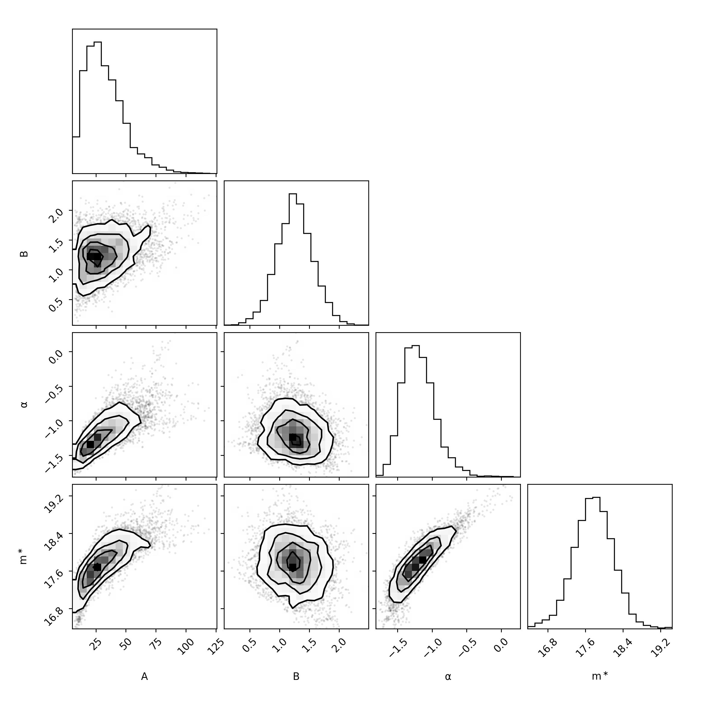
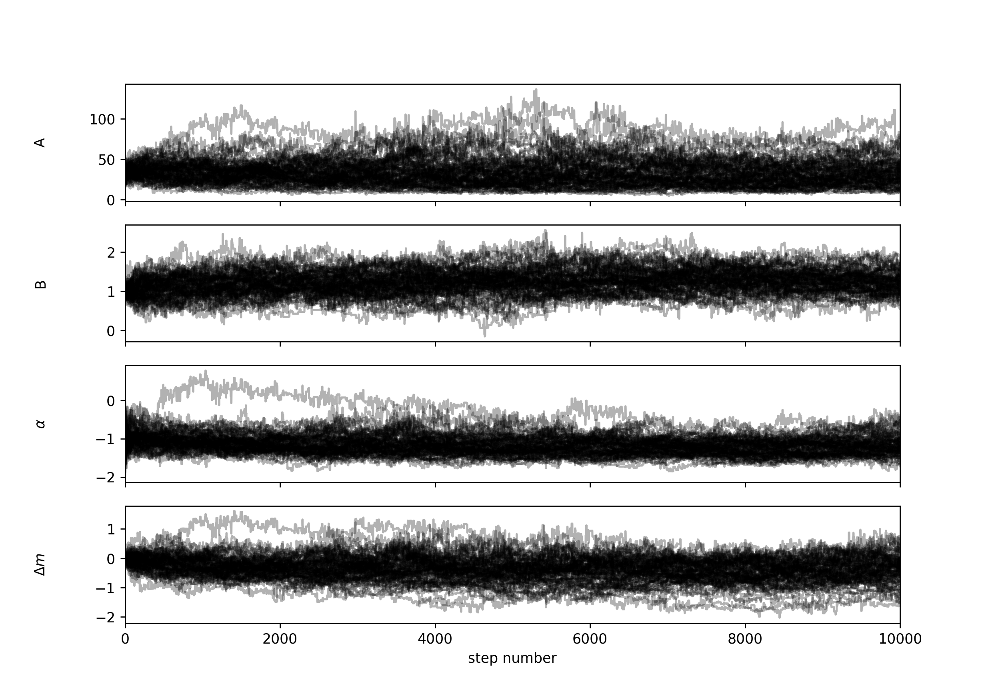
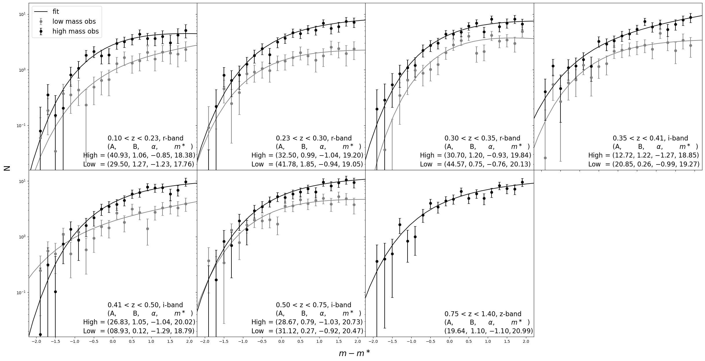

### mceh v4.1.0
Clusters were grouped based on their redshift and mass listed in the following table.

|redshift|0.10~|0.23~|0.30~|0.35~|0.41~|0.50~|0.75~|~1.4|
|--------|-----|-----|-----|-----|-----|-----|-----|----|
|$\log{M/M_\odot}$|13.73|13.87|13.99|14.02|14.06|14.17|14.52|None|

For example, the first group is $0.10\le z < 0.23$ and $\log{(M/M_\odot)}<13.73$ and the second is the same redshift with $\log{(M/M_\odot)}\ge 13.87$. The last redshift group (~1.4) has only one mass group.

The first grouping creteria is the band shift based on the redshift, since I used the bands just redder than 4000 break, so the redshift division is 0.35, 0.75, 1.12 that separates r, i, z, y bands. The second criteria is letting each redshift group has ~40 clusters. The last creiteria is creating the mass groups that has ~20 clusters under each redshift group.

The generating codes is `mcmc20241224.py`

- Group the clusters by the above creteria
- Clusters are chose that `low_cont_flag` == `True` and `unmasked_fractiom` > 0.6
- $\phi^\ast=A(M/M_{\text{piv}})^B$
- Common background (for each band)

### Result

