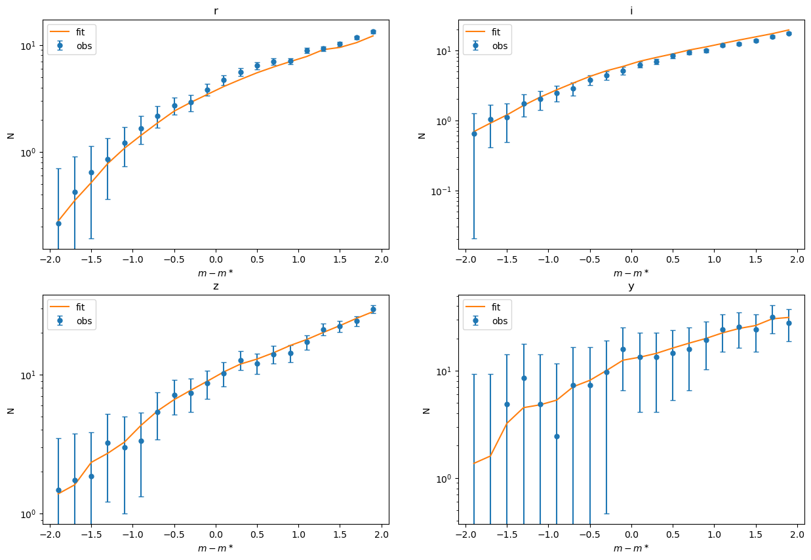

## mceh v5.0.0

This version fits overall parameter trends on mass and redshift. The model code is `zm_group_phi_model_schechter.py`

About the model:
- Clusters are chose that `low_cont_flag` == `True` and `unmasked_fractiom` > 0.6 and there's no grouping anymore
- Every parameter are modeled with mass and redshift:
$$
\begin{align*}
\phi^\ast = \phi_0 \left(\frac{M}{M_{\text{piv}}}\right)^{\beta_\phi}\left(\frac{1 + z}{1 + z_{\text{piv}}}\right)^{\gamma_\phi} \\
\alpha = \alpha_0 \left(\frac{M}{M_{\text{piv}}}\right)^{\beta_\phi}\left(\frac{1 + z}{1 + z_{\text{piv}}}\right)^{\gamma_\alpha} \\
\Delta m^\ast = m_0 \left(\frac{M}{M_{\text{piv}}}\right)^{\beta_m}\left(\frac{1 + z}{1 + z_{\text{piv}}}\right)^{\gamma_m}
\end{align*}
$$
$(\phi_0, \beta_\phi, \gamma_\phi, \beta_\alpha, \gamma_\alpha, \beta_m, \gamma_m)$ are also called $(A, B, C, D, E, F, G)$.

About the codes:
- Fixed the problem that the unmasked fractions are not considered
- `model` folder is created and different model has its own codes in it and the code is equivalent to `fitting.py` from the previous versions

The generating codes of the result in order are `mcmc20241219.py`, `mcmc20241220_continue.py` and `mcmc20241222_continut.py`. The following figures can be found in `20241223.ipynb`.
Result figures:

