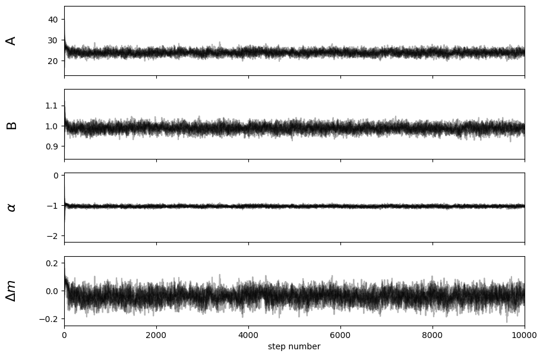

## mceh v5.1.0

This version fits the mock catalog without background, for both overall and grouping samples.
The model name is `zm_group_phi_model_nobkg.py`.

About the model:
- Clusters are chose that `low_cont_flag` == `True` and `unmasked_fractiom` > 0.6
- Two types of modes, `group`(grouping rule is the same as before) and `overall`(all clutsters at once)
- $\phi (\text{logMass}) = A(\text{Mass} / \text{PivotMass})^B$
- No background considered since it's for the mock catalog

Result:
Overall:

Group:

