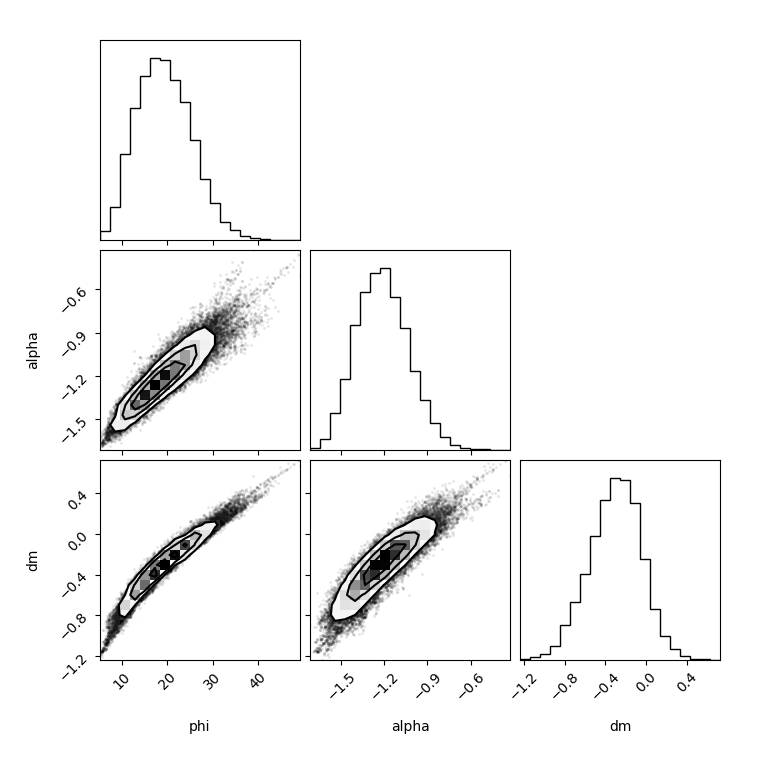
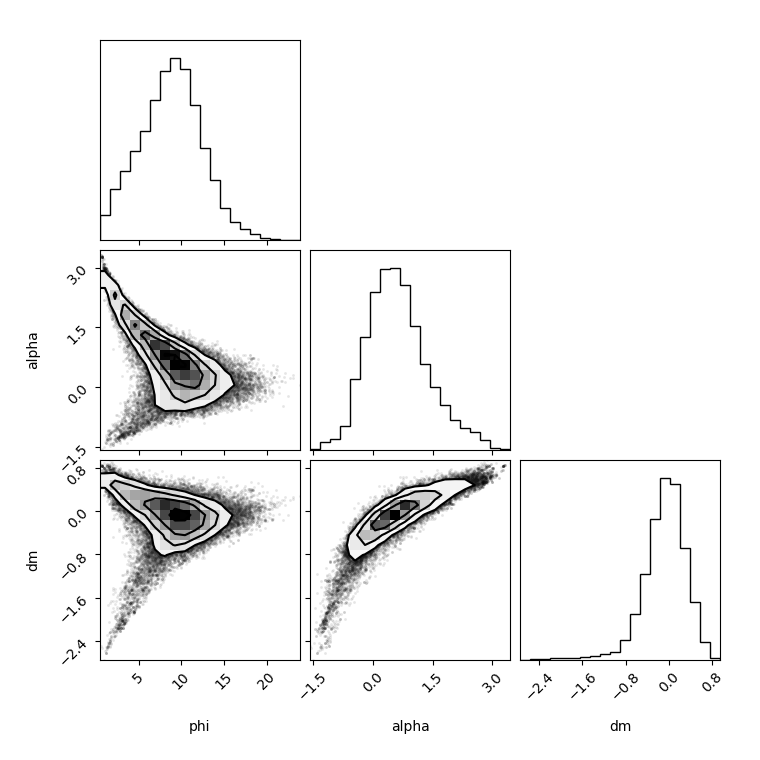

## mceh v5.1.0

The new model added is `all_redblue.py`

- Three parameters $(\phi, \alpha, \Delta m)$ for the Schechter function
- Red-bue separation
- The red/ble background LF is a Gussian with $\mu = \Sigma_i \mu_i/N$ and $\sigma=\Sigma_i \sigma_i^2$, where $i$ is the ith cluster background estimation
- Clusters are grouped based on their redshift. The bins are [0.1 , 0.14, 0.18, 0.22, 0.27, 0.31, 0.35, 0.43, 0.51, 0.59, 0.67, 0.75, 0.94, 1.12, 1.31]. But the last bin contains only 1 cluster, so it was moved to the second last bin

Results:
These are the group results with only the red parts. The generation code is in `20250607mcmc_red.py`.

