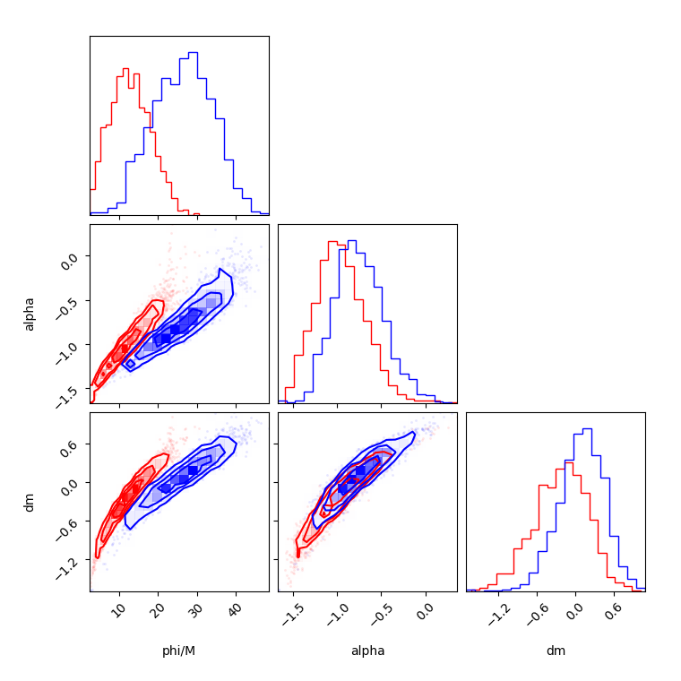
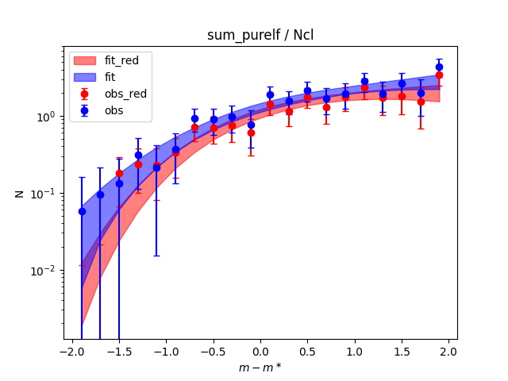

Two models were added, `group_mass_phi_guassian` and `group_redblue_mass_phi_guassian`.
These models are both:
- Fit the sum of the pure LF (Total LF - background) in each group
- The clusters are grouped based on their redshift ([0.1 , 0.14, 0.18, 0.22, 0.27, 0.31, 0.35, 0.43, 0.51, 0.59, 0.67, 0.75, 0.94, 1.12, 1.31]. Since the last bin contain only 1 cluster, it is moved to the second last group)
- Only used mag between `ms_model` $\pm 2$
- Assume the Guassian uncertainty on both total LF and background
The only difference between two models is `group_mass_phi_guassian` does not use the red-blue separation while`group_redblue_mass_phi_guassian` does.

The details in likelihood and prior are shown on the last part of this file.

Results:

Posterior details:
We have $N_{obs,i}$ for the observation count of $i$th cluster LF (for each magnitude bin), and also $N_{bkg,ij}$ for the background count of $i$th cluster and $j$th random apertures. Then, by correcting the unmasked fraction for the cluster $f_{obs, i}$ and background $f_{bkg, ij}$, and the full aperture area $A_{obs, i}$ and $A_{bkg, ij}$ we have
$$
\begin{align}
S_i = N_{obs,i} / f_{obs, i}\quad \text{(corrected observation)} \\
B_{ij} = N_{bkg, ij} / f_{bkg, ij} \quad \text{(corrected background)} \\
b_{ij}=B_{ij}/A_{bkg, ij}\quad \text{(background density)}
\end{align}
$$
The summation of the corrected observation $S_{sum} :=\sum_i S_i$ is the same as the summation of weighted count $\sum_i N_{obs, i}w_{obs, i}$ with $w_{obs, i}\equiv 1/f_{obs, i}$. The uncertainty $\sigma_{obs, sum}$ of the observed $S_{sum}$ is thus obtained by
$$
\sigma_{obs, sum}^2=\sum_i w_{obs, i}^2 \sigma_{obs,i}^2=\sum_i \frac{1}{f_{obs, i}^2}N_{obs, i},
$$
where $\sigma_{obs, i}$ is the uncertainty of the observed $N_{obs, i}$. Since it follows a Poisson distribution, $\sigma_{obs, i} = \sqrt{N_{obs, i}}$.

With $S_{sum}$ large enough (say >10 counts), it approaches $\mathcal{N}(S_{sum}, \sigma_{obs, sum}^2)$.

For the background part, we assumed an Gussian cosmic variance ($b_i \sim \mathcal{N}(\,\mu_{bkg, i}, \sigma^2_{bkg,i})$) for the LF density through 3000 random apertures for each cluster. The uncertainty is ignored since $1/\sqrt{3000} \approx 1.8\%$. Then, the background mean $\mu_{bkg, i}$ and variance $\sigma^2_{bkg, i}$for each cluster is
$$
\begin{align}
\mu_{bkg, i}=\frac{1}{N_{rd}}\sum_j b_{ij} \\
\sigma^2_{bkg, i}=\frac{\sum_j (b_{ij}-\mu_{bkg, i})^2}{N_{rd}-1},
\end{align}
$$
where $N_{rd}$ is the number of random apertures (=3000). The background sum is then $\sim \mathcal{N}(B_{sum}:=\sum_i \mu_{bkg, i}A_{obs, i}, \sum_i \sigma^2_{bkg, i}A_{obs, i}^2)$.

Finally, the observation sum minus the background sum $\sim \mathcal{N}(S_{sum}-B_{sum},\sigma^2_{obs, sum} + \sum_i  \sigma^2_{bkg, i}A^2_{obs, i})$.

For a set of parameters $(\phi^\prime, \alpha, \Delta m)$, where $\phi^\prime$ is the normalization per pivot mass ($\phi=\phi^\prime (M/M_{piv})$), the model pure LF sum is $LF_{sum}=\sum_i\mathrm{Schechter}\left(\phi^\prime (M_i/M_{piv}), \alpha, m_i+\Delta m, \mathrm{bins=DIFF\_ BINS}+m_i\right)$, where $M_i$, $m_i$ is the $i$th mass and model $m^\ast$ of the clusters, and `DIFF_BINS` equals `np.arange(-2, 2.1, 0.2)`.
